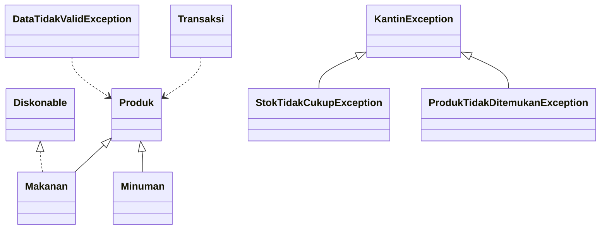

# Campus Cafeteria System — OOP Week 14

A runnable Java console implementation of a guided Week 14 Object-Oriented Programming lab. The project models a cafeteria transaction using abstraction, inheritance, polymorphism, an interface, collections, and exception handling.

## What it demonstrates

- Abstract `Produk` as the base product type
- `Makanan` and `Minuman` specializations
- `Diskonable` as a discount contract
- Polymorphic rendering through a `Produk[]` menu
- `ArrayList`-based transaction items and quantities
- Checked business exceptions for stock and lookup failures
- Unchecked validation errors for invalid source data
- `try/catch`, multi-catch, parent-class catch, and `finally`

## Highlights

| Area | Implementation |
| --- | --- |
| Product model | Abstract `Produk` with `Makanan` and `Minuman` subclasses |
| Discount | 10% food discount when the unit price is above Rp15.000 |
| Transaction | Product quantities, totals, and receipt output |
| Error handling | Stock, lookup, business, and validation exceptions |
| Demo | Successful transaction plus required failure scenarios |

## Repository structure

```text
src/
├── Produk.java
├── Makanan.java
├── Minuman.java
├── Diskonable.java
├── Transaksi.java
├── KantinException.java
├── StokTidakCukupException.java
├── ProdukTidakDitemukanException.java
├── DataTidakValidException.java
└── Main.java

docs/
├── BLUEJ_GUIDE.md
├── CLASS_DIAGRAM.md
├── REQUIREMENT_TRACEABILITY.md
└── TESTING.md
```

## Run locally

The project uses the Java standard library and was tested with JDK 21:

```bash
rm -rf out
javac -d out src/*.java
java -cp out Main
```

## Expected demonstration

The first transaction combines two `Ayam Goreng Crispy` items and one `Es Teh Manis`, applying the food discount and producing a total of **Rp 37.400**. The program then demonstrates insufficient stock, missing-product lookup, multi-catch, parent exception handling, and invalid data validation.

## Documentation

- [Class Diagram](docs/CLASS_DIAGRAM.md)
- [BlueJ Guide](docs/BLUEJ_GUIDE.md)
- [Requirement Traceability](docs/REQUIREMENT_TRACEABILITY.md)
- [Testing Notes](docs/TESTING.md)

## Scope note

This is a focused academic console project, not a production ordering platform. The source is documented as a course-aligned implementation for learning and assessment review.
## OOP relationship



## Portfolio evidence

The implementation demonstrates abstraction, inheritance, polymorphism, interface-based discount behavior, collections, and multiple exception-handling patterns in one small domain.

### Validation command

```bash
rm -rf out
javac -d out src/*.java
java -cp out Main
```

Expected scenarios are documented in [`docs/TESTING.md`](docs/TESTING.md).

## Limitations

- Console-only interface
- No persistence or authentication
- No external dependencies
- Designed for the Week 14 academic lab rather than production deployment

## License

This repository is licensed under the [MIT License](LICENSE). The license applies to the original source and documentation included in this repository. Third-party dependencies, frameworks, fonts, images, and other external materials remain subject to their respective licenses and attribution requirements.
