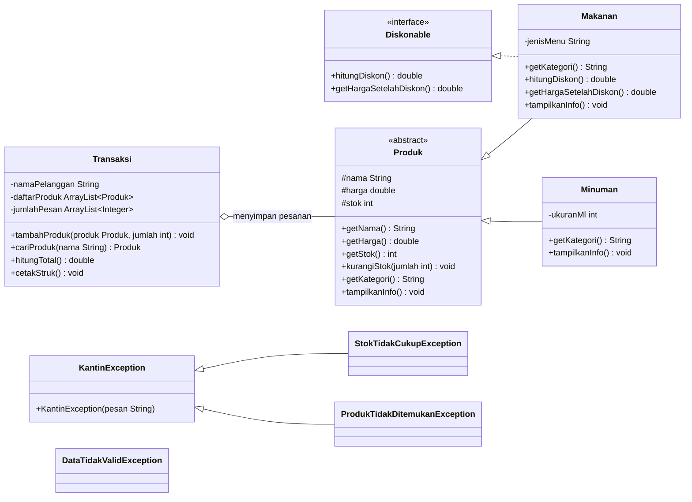

# Class Diagram

The diagram below reflects the structure compiled by BlueJ. All source classes intentionally remain in the default package, so this document is a reference rather than another package layer.

## Design decisions

`Produk` contains common product state and enforces stock reduction through `kurangiStok()`. This means `Transaksi` does not mutate stock directly. `Makanan` owns the discount behavior because the lab only gives food a discount; `Minuman` deliberately does not implement `Diskonable`.

`Transaksi` demonstrates polymorphism by storing both product subtypes in one `ArrayList<Produk>`. The paired `jumlahPesan` list preserves the quantity for the product at the same index. `KantinException` creates one checked-exception family that can be caught either specifically or through its parent type.
